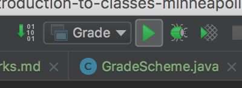
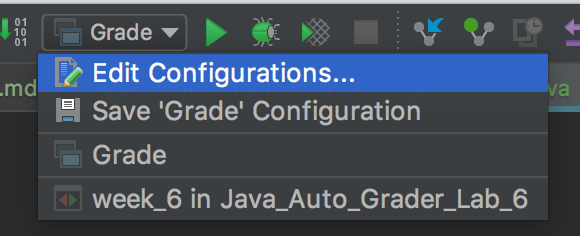
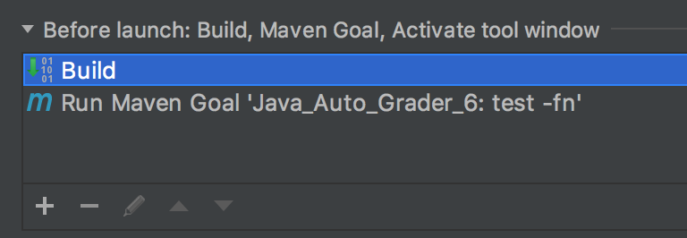

## Lab Grading

The file called week_*.json contains the names of all the question code files in the lab, an array of the associated test files, and the total points for each question.

There are a set of tests for each question. The tests may be in more than one file. To grade a question, the tests are run. The number of passing tests, out of the total number of tests, is used to determine the number of points earned for that question.

For example, a question could be worth 8 points, and have 6 tests. 

If all 6 tests pass, the full 8 points would be earned.
If half of the tests pass, 4 points would be earned.
If 4 out of 6 tests pass, 4/6 * 8 = 5.33 points would be earned.
If no tests pass, no points are earned. 

All of the questions are graded in this way. The total for all of the questions is added together to calculate the total points for the lab.

After the autograder runs, the instructor will review your code and may adjust your grade if needed. For example, if a problem is almost completed but does not quite pass the tests, extra points may be assigned. Conversely, if a test passes but the code is badly written, or lacks comments, or has other issues, then points may be taken away.    

### Estimated points for lab

In src/main/java/grade, the Java file `Grade.java` may be run to calculate an estimated grade, based on the results of running the tests. 

Run Grade.java via the run configurations, menu bar, top right.

If this errors, ensure the run configuration is configured correctly.

Select Grade from the dropdown. Click again and Select Edit Configurations

In the Before Launch section, verify that there is a Maven task listed, as in this screenshot, 

If not, click on the + button in the Before Launch section. Select Run Maven Goal.

In the Command field, type `test -fn` and click OK.

The Before Launch should now look like this

Try running Grade.java again. If it still gives you errors, please push all of your code to GitHub and notify the instructor. 

 
